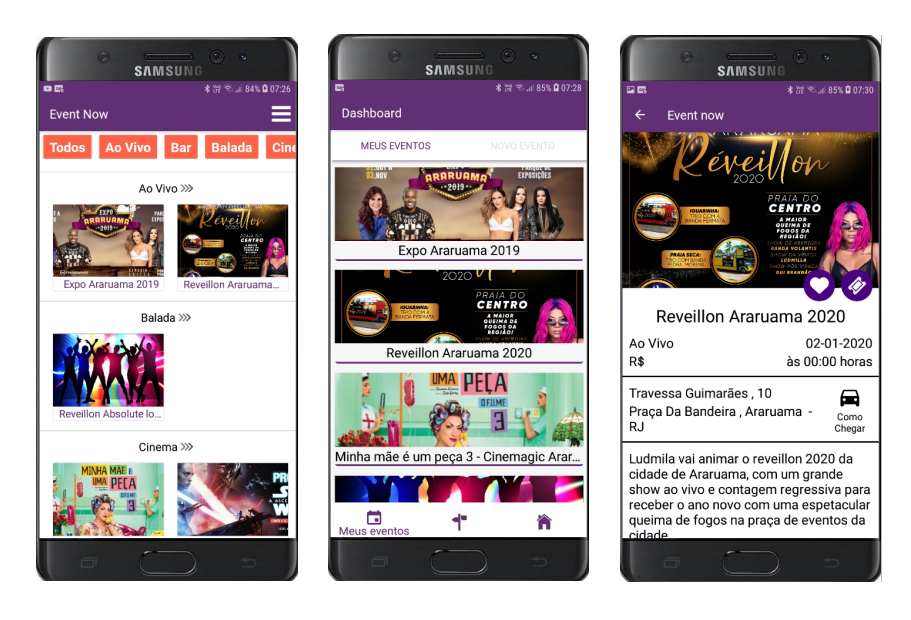

<h1 align="center">
    
</h1>

<h4 align="center">
   Event Now
</h4>

  <a href="#-projeto">Projeto</a>&nbsp;&nbsp;&nbsp;|&nbsp;&nbsp;&nbsp;
  <a href="#-layout-e-funcionalidades">Layout e Funcionalidades</a>&nbsp;&nbsp;&nbsp;|&nbsp;&nbsp;&nbsp;
  <a href="#-tecnologias">Tecnologias</a>

## 💻 Projeto

<h3>Problema</h3>
As empresas da região dos lagos do RJ tinham um alto custo com divulgação de eventos através de outdoors e flyers que, além de custarem caro, acarretavam em disperdicio e poluição do meio ambiente
<h3>Solução</h3>
Foi desenvolvido um app mobile para android e ios que permite que as empresas divulguem seus eventos de maneira 100% digital, assim como permite que usuários busquem eventos de maneira fácil através de filtros.
<h3>Resultado</h3>
A estimativa é que o Event Now reduza em cerca de R$1000,00/mês o custo das empresas com divulgação dos eventos.

## 🔖 Layout e Funcionalidades

- Cadastar eventos para divulgação
- Buscar eventos através de filtros
- Adicionar eventos a lista de favoritos
- Exibir rotas do local atual do usuário até o endereço do evento
- Receber lembrete do evento
- Comprar ingressos para o evento

<h1 align="center">
    
</h1>

## 🚀 Tecnologias

Esse projeto foi desenvolvido com as seguintes tecnologias:

- [React Native](https://facebook.github.io/react-native/)
- [Redux](https://redux.js.org/)
- [Redux Persist](https://www.npmjs.com/package/redux-persist)
- [Styled Components](https://styled-components.com/)
- [Firebase](https://firebase.google.com/)
- [React Native Maps](https://www.npmjs.com/package/react-native-maps)
- [Lottie](https://lottiefiles.com/)

## 🏃‍♂️ Instalando o projeto

- Clone ou baixe o repositório.
- `yarn` para instalar todas as dependências.
- `yarn android` para abrir o projeto no Android.
- `yarn ios`para abrir o projeto no iPhone.
- `yarn start` para incializar o Metro Bundler.
